# ED Bot v8 - Query Processing Flow Diagram

## Visual Flow Diagram

```mermaid
graph TB
    %% Frontend Layer
    subgraph "🖥️ Frontend (Browser)"
        A[User Input<br/>static/index.html:44-49] --> B[JavaScript Handler<br/>static/js/app.js:111-177]
        B --> C[POST /api/v1/query<br/>static/js/app.js:135-145]
    end

    %% API Gateway
    subgraph "🚪 API Gateway"
        C --> D[FastAPI Router<br/>src/api/app.py:38]
        D --> E[process_query Endpoint<br/>src/api/endpoints.py:24-42]
    end

    %% Query Processing Pipeline
    subgraph "⚙️ Query Processor"
        E --> F[QueryProcessor.process_query<br/>src/pipeline/query_processor.py:35-108]
        
        F --> G{Query Classification<br/>src/pipeline/classifier.py:137-180}
        
        G -->|Rule-based<br/>confidence > 0.9| H[Regex Patterns<br/>classifier.py:182-207]
        G -->|Ambiguous<br/>confidence ≤ 0.9| I[LLM Classification<br/>classifier.py:209-249]
        
        H --> J[Hybrid Decision<br/>classifier.py:163-175]
        I --> J
    end

    %% Query Routing
    subgraph "🔀 Query Router"
        J --> K{Route by Type<br/>src/pipeline/router.py:26-45}
        
        K -->|CONTACT| L[Contact Handler<br/>router.py:47-95<br/>Mock Amion]
        K -->|FORM| M[Form Handler<br/>router.py:97-158<br/>PDF Links]
        K -->|PROTOCOL| N[Protocol Handler<br/>router.py:160-232<br/>RAG + LLM]
        K -->|CRITERIA| O[Criteria Handler<br/>router.py:234-277<br/>Entity Lookup]
        K -->|DOSAGE| P[Dosage Handler<br/>router.py:279-342<br/>Safety Check]
        K -->|SUMMARY| Q[Summary Handler<br/>router.py:344-376<br/>Multi-RAG]
    end

    %% Response Generation
    subgraph "📝 Response Formatter"
        L --> R[Format Response<br/>src/pipeline/response_formatter.py:33-115]
        M --> R
        N --> R
        O --> R
        P --> R
        Q --> R
        
        R --> S[Safety Validation<br/>formatter.py:555-594]
        S --> T[Add Warnings<br/>formatter.py:514-553]
        T --> U[Preserve Citations<br/>formatter.py:450-497]
    end

    %% Caching Layer
    subgraph "💾 Cache Layer"
        U --> V{Cache Decision<br/>query_processor.py:122-156}
        V -->|FORM/CONTACT| W[Skip Cache]
        V -->|Others| X[Redis Cache<br/>TTL: 5-60 min]
        W --> Y[Return Response]
        X --> Y
    end

    %% Response Return
    subgraph "📤 Response"
        Y --> Z[QueryResponse<br/>endpoints.py:36]
        Z --> AA[Frontend Display<br/>static/js/app.js:179-215]
    end

    %% Styling
    classDef frontend fill:#e1f5fe,stroke:#01579b,stroke-width:2px
    classDef api fill:#f3e5f5,stroke:#4a148c,stroke-width:2px
    classDef processor fill:#fff3e0,stroke:#e65100,stroke-width:2px
    classDef router fill:#e8f5e9,stroke:#1b5e20,stroke-width:2px
    classDef formatter fill:#fce4ec,stroke:#880e4f,stroke-width:2px
    classDef cache fill:#f1f8e9,stroke:#33691e,stroke-width:2px
    classDef response fill:#e0f2f1,stroke:#004d40,stroke-width:2px
    
    class A,B,C frontend
    class D,E api
    class F,G,H,I,J processor
    class K,L,M,N,O,P,Q router
    class R,S,T,U formatter
    class V,W,X cache
    class Y,Z,AA response
```

## Query Type Flow Details

```mermaid
graph LR
    subgraph "Query Types & Handlers"
        A[User Query] --> B{Classification}
        
        B --> C[🏥 CONTACT_LOOKUP]
        C --> C1[Mock Amion Service]
        C1 --> C2[Phone/Pager Info]
        
        B --> D[📄 FORM_RETRIEVAL]
        D --> D1[Filename Matching]
        D1 --> D2[PDF Download Links]
        
        B --> E[📋 PROTOCOL_STEPS]
        E --> E1[RAG Retrieval]
        E1 --> E2[LLM Formatting]
        E2 --> E3[Steps + Timing]
        
        B --> F[✅ CRITERIA_CHECK]
        F --> F1[Entity Search]
        F1 --> F2[Threshold Formatting]
        
        B --> G[💊 DOSAGE_LOOKUP]
        G --> G1[Medication Extract]
        G1 --> G2[Safety Validation]
        G2 --> G3[Warnings Added]
        
        B --> H[📚 SUMMARY_REQUEST]
        H --> H1[Multi-Source RAG]
        H1 --> H2[LLM Synthesis]
        H2 --> H3[Confidence Score]
    end
    
    style A fill:#f9f9f9
    style B fill:#ffe0b2
    style C fill:#e1f5fe
    style D fill:#f3e5f5
    style E fill:#e8f5e9
    style F fill:#fff3e0
    style G fill:#ffebee
    style H fill:#f1f8e9
```

## Data Flow Through Components

## Key Performance Metrics

```mermaid
graph TD
    subgraph "⏱️ Performance Targets"
        A[Total Response Time<br/><1.5s target]
        A --> B[Classification<br/>~50-200ms]
        A --> C[Routing & Retrieval<br/>~200-500ms]
        A --> D[LLM Generation<br/>~500-800ms]
        A --> E[Formatting<br/>~50-100ms]
        A --> F[Caching<br/>~10-20ms]
    end
    
    subgraph "💾 Cache TTL by Type"
        G[FORM: No cache]
        H[CONTACT: No cache]
        I[PROTOCOL: 1 hour]
        J[CRITERIA: 1 hour]
        K[DOSAGE: 30 min]
        L[SUMMARY: 5 min]
    end
    
    subgraph "🎯 Accuracy Targets"
        M[Classification: >90%]
        N[Citation Preservation: 100%]
        O[Safety Validation: 100%]
    end
```

## Source Attribution Flow

```mermaid
graph LR
    subgraph "📚 Source Citation Preservation"
        A[Document] --> B[DocumentRegistry<br/>display_name mapping]
        B --> C[RAG Retrieval<br/>includes source metadata]
        C --> D[Router preserves<br/>source info]
        D --> E[Formatter extracts<br/>formatter.py:450-497]
        E --> F[Response includes<br/>display names]
        F --> G[Frontend shows<br/>'Blood Transfusion Form'<br/>not 'Source:1']
    end
    
    style A fill:#e3f2fd
    style B fill:#e8eaf6
    style C fill:#ede7f6
    style D fill:#f3e5f5
    style E fill:#fce4ec
    style F fill:#ffebee
    style G fill:#ffcdd2
```

## HIPAA Compliance Points

## Notes

- **Frontend**: Single-page application with real-time query processing
- **Classification**: Hybrid approach ensures >90% accuracy
- **Routing**: Type-specific handlers optimize for each query category
- **Safety**: Multiple validation layers for medical content
- **Performance**: Aggressive caching where appropriate, skip for time-sensitive data
- **Citations**: Complete preservation from source documents through to display